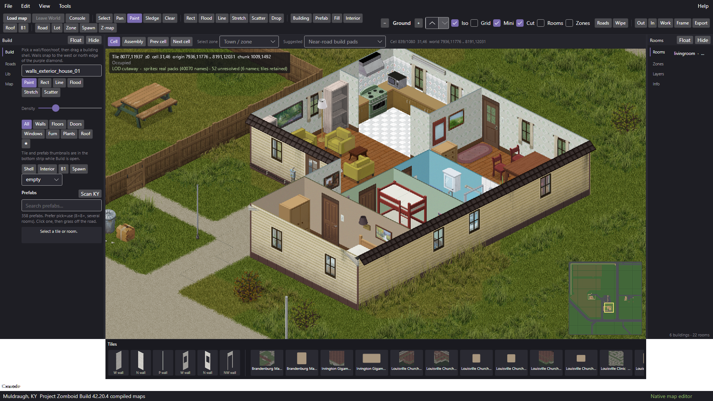
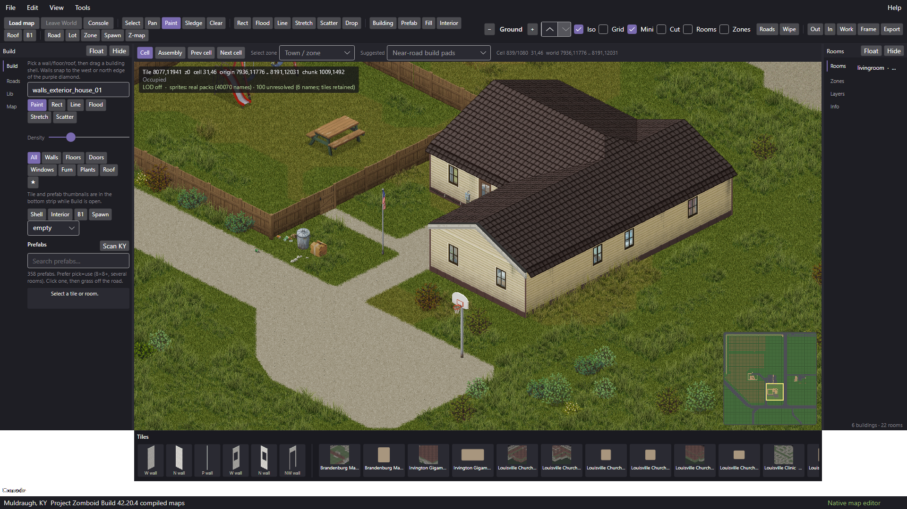
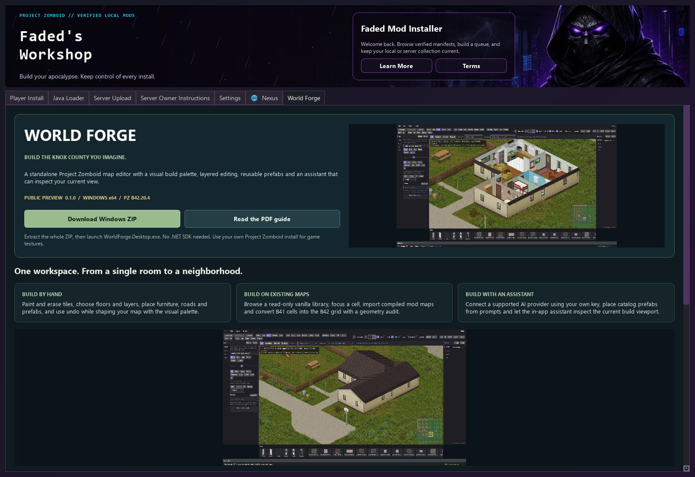

# World Forge

**Build the Knox Country you imagine.** A standalone map editor targeting Project
Zomboid Build 42.20.4, with a native isometric viewport, visual building palette,
layered editing, reusable prefabs and an optional assistant that can inspect your view.

**Windows x64 · 0.1.0 public preview · Runtime included**

[Download World Forge](https://github.com/FadedMods/faded-mod-installer-cloud/releases/download/worldforge-0.1.0-preview.1/WorldForge-0.1.0-preview.1-win-x64.zip)
· [Illustrated PDF guide](https://github.com/FadedMods/faded-mod-installer-cloud/releases/download/worldforge-0.1.0-preview.1/WorldForge-User-Guide.pdf)
· [Release notes and checksums](https://github.com/FadedMods/faded-mod-installer-cloud/releases/tag/worldforge-0.1.0-preview.1)

## Your first map

1. Download and extract the entire ZIP into a writable folder.
2. Run `WorldForge.Desktop.exe`. Keep its DLLs, prefabs and folders together.
3. Link your own Project Zomboid installation for vanilla maps and textures.
4. Open a cell, choose the active floor and build with the bottom visual palette.
5. Save your project, review its rooms/spawns/zones and test exports in an isolated game save.

This is a portable application, not a game mod. No .NET SDK, Java engine, TileZed
or WorldEd installation is required. Game and Workshop files stay read-only.
Projects and caches live under `%USERPROFILE%\WorldForge`.

## What you can do

- Paint and erase tiles, edit floors/layers, navigate with the minimap and undo changes.
- Browse a local vanilla library, import compiled mod maps and place catalog prefabs.
- Convert B41 cells to the B42 grid with a geometry audit.
- Assign loot-room names, create spawns/zones and export B42 map packages.
- Ask the in-app assistant to inspect the current build viewport before editing.
- Prepare custom sprites, import tile packs and use OSM roads/building shells.
- Explore optional Meshy/Tripo adapters and the bundled CLI/stdio MCP host.

Try this in the Assistant after connecting a supported provider:

> Find a clear block beside an existing road and build a small town using prefabs.
> Use three homes and one shop, preserve existing buildings, connect paths to the road,
> and report the buildings and rooms you placed.

For work on the building you are viewing:

> Look at the building currently on screen. Identify its exterior doors and windows,
> then help me barricade it. If more than one building could be my target, ask which one.
> Preserve the original openings and check the result.

Vision providers can receive a viewport image. Text providers receive structured
map sight. AI services use your own keys and their own pricing. Review edits and
use undo when needed. External MCP clients have a separate session and camera.

## Find it in the Faded installer

[Installer 0.3.6](https://github.com/FadedMods/faded-mod-installer-cloud/releases/tag/faded-local-mod-installer-0.3.6)
adds **World Forge** immediately beside **Nexus**. Its page includes screenshots,
download and guide buttons, a quick start and copyable prompts.

The installer is available for Windows, multilingual Windows, standard Linux,
Steam Deck, Apple Silicon and Intel Macs. World Forge itself is currently Windows x64.

## Preview scope and credits

In-game load, collision, loot, stairs and multiplayer export acceptance have not
been certified. Full live-save reconstruction and a complete furnished KnoxMap
generator are not shipped GUI features. Some procedural vegetation is absent from
the preview. The PDF explains each workflow and its current limits.

World Forge: **FadedMods.com / Faded Realms Game Studio / TryLisa.ai**.
Credit to **euclid80tr (spytheeuclidean-a11y), KnoxMap**, for the attributed footprint
geometry adaptation, and **ZomboSlicer, published at Stylo's site**, for sprite
preparation adapted with permission. Full notices ship in the ZIP and guide.
Project Zomboid and game artwork belong to **The Indie Stone**. Game texture packs
and maps are not bundled. This is an unofficial community tool.
